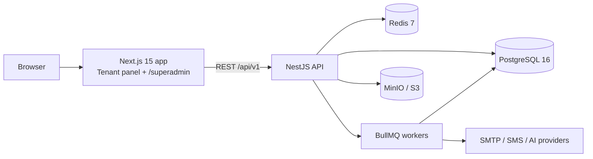

# ARCHITECTURE

## System

- **One Next.js app, two panels.** Tenant panel at `/`, super admin at `/superadmin`.
  Separate layouts, separate auth realms (JWT audience `tenant` vs `platform`), middleware
  blocks cross-realm access. (ADR-001: one frontend codebase instead of two apps — halves
  boilerplate, shared design system; security preserved via realm separation.)
- **NestJS API** is the only writer to the DB. Modular monolith: `modules/<domain>`.
- **Multi-tenancy:** shared schema, `tenant_id` row isolation, enforced by a Prisma client
  extension reading AsyncLocalStorage request context — endpoints cannot forget the filter.
  Platform tables have no `tenant_id` and are only reachable from `platform`-realm endpoints.
- **Background jobs (BullMQ):** mail, sms, notifications, schedule-materialize (nightly
  generates lesson occurrences 12 weeks ahead), billing (renewals/dunning), usage-metering,
  reports, ai, webhooks, imports.
- **Caching:** Redis for permission sets, plan/feature matrix per tenant, dashboard KPO
  aggregates (60s TTL), rate limiting.
- **Files:** S3 SDK against MinIO (dev) / any S3 (prod); private buckets, presigned URLs.

## Request context flow

JWT → `AuthGuard` validates → `TenantContextInterceptor` stores `{userId, tenantId, realm,
permissions, branchIds}` in AsyncLocalStorage → Prisma extension injects `tenantId` into every
query on tenant-scoped models → `PermissionsGuard` checks `@RequirePermissions()` metadata.

## Auth

Access JWT 15 min + rotating refresh token (httpOnly cookie, hashed in DB, family reuse
detection). Argon2id passwords. Optional TOTP 2FA. Separate realms & audiences for tenant vs
platform users. Impersonation: platform user mints 30-min tenant token; audited; UI banner.

## RBAC

Permission constants `module.action` in `packages/shared` (single source for API + UI).
Seeded roles: owner, admin, branch_manager, teacher, accountant, receptionist, marketer +
custom roles per tenant. Assignments may be branch-scoped. Frontend: `<Can>` gate + hook.
Platform realm roles: super_admin, support, finance, analyst.

## Plan limits & feature gates

`plans.limits` + `plans.features` JSONB → cached per tenant → `UsageService.assert(limit)` on
create paths (402 `PLAN_LIMIT_REACHED`) → daily metering into `usage_records`. Feature flags:
global catalog + per-tenant override.

## Schedule engine

`schedule_rules` (weekly recurrence) → materialized `lessons` 12 weeks ahead (nightly job +
on-write). `POST /schedule/validate` returns full conflict list (teacher/room/group overlap,
capacity, working-hours, min-break, holidays) — used by UI during drag & drop; same validator
runs transactionally on commit. Series edits: this / following / all.

## Error envelope

`{success, data, meta}` / `{success:false, error:{code, message, details}}`; stable error
codes; localized messages; 401/403/402/422 semantics per `MASTER_PROMPT/02_BACKEND.md §4`.

## Environments

dev (docker compose), prod (multi-stage Dockerfiles, compose/K8s-ready). Config validated with
zod at boot. CI: GitHub Actions — lint, typecheck, test, build.
